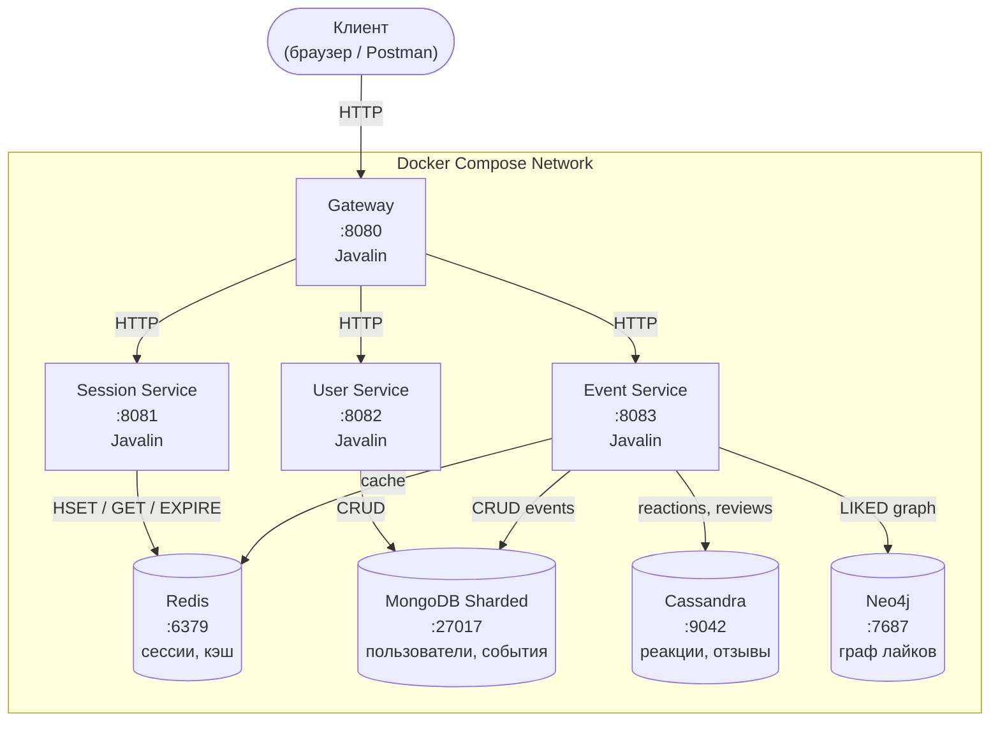
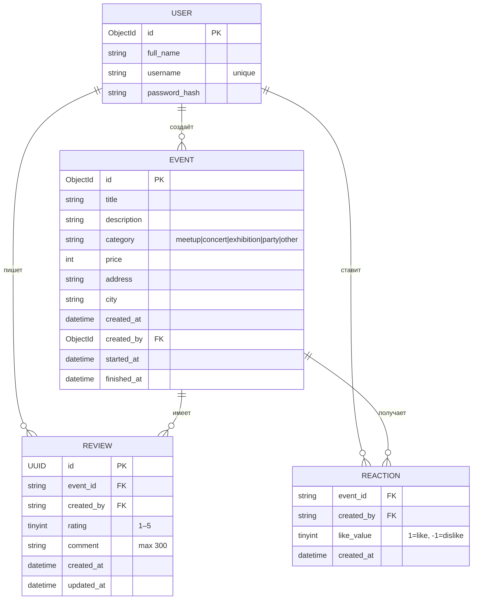

# EventHub NoSQL

Сервис управления событиями, демонстрирующий полиглотную персистентность на базе четырёх NoSQL-хранилищ. Реализует
gateway-паттерн с четырьмя микросервисами на Javalin.

[](https://github.com/arnmacing/itmo_nosql/actions/workflows/eventhub.yml)
[](https://github.com/arnmacing/itmo_nosql/releases)
[](https://openjdk.org/projects/jdk/17/)
[](LICENSE)

---

## Содержание

- [Технологический стек](#технологический-стек)
- [Архитектура проекта](#архитектура-проекта)
- [Функциональные требования](#функциональные-требования)
- [API](#api)
- [Инструкция по запуску](#инструкция-по-запуску)
- [Конфигурация](#конфигурация)
- [Тестирование](#тестирование)

---

## Технологический стек

| Категория                   | Технология                                                                     | Версия | Назначение                                                   |
|-----------------------------|--------------------------------------------------------------------------------|--------|--------------------------------------------------------------|
| Язык                        | Java                                                                           | 17     | Основной язык разработки                                     |
| Система сборки              | Maven                                                                          | 3.x    | Управление зависимостями, сборка fat-JAR                     |
| Веб-фреймворк               | [Javalin](https://javalin.io/)                                                 | 6.7.0  | Лёгкий HTTP-фреймворк для всех четырёх сервисов              |
| Сериализация                | [Jackson](https://github.com/FasterXML/jackson)                                | 2.17.2 | JSON-маппинг запросов и ответов                              |
| БД - сессии / кэш           | [Redis](https://redis.io/)                                                     | 7.4    | Сессии пользователей и кэш реакций/отзывов/рекомендаций      |
| БД - пользователи / события | [MongoDB](https://www.mongodb.com/)                                            | 7      | Основное хранилище пользователей и событий (sharded cluster) |
| БД - реакции / отзывы       | [Cassandra](https://cassandra.apache.org/)                                     | 4.1    | Масштабируемое хранилище реакций и отзывов                   |
| БД - рекомендации           | [Neo4j](https://neo4j.com/)                                                    | 5.26.1 | Граф лайков, коллаборативная фильтрация                      |
| Драйвер MongoDB             | [mongodb-driver-sync](https://www.mongodb.com/docs/drivers/java/sync/current/) | 5.2.0  | CRUD-операции с MongoDB                                      |
| Драйвер Cassandra           | [cassandra-driver-core](https://docs.datastax.com/en/developer/java-driver/)   | 4.17.0 | Работа с Cassandra                                           |
| Драйвер Neo4j               | [neo4j-java-driver](https://neo4j.com/docs/java-manual/current/)               | 5.26.0 | Bolt-соединение с Neo4j                                      |
| Драйвер Redis               | [Jedis](https://github.com/redis/jedis)                                        | 5.2.0  | Операции с Redis                                             |
| Безопасность                | [jBCrypt](https://www.mindrot.org/projects/jBCrypt/)                           | 0.4    | Хэширование паролей                                          |
| Логирование                 | [Logback](https://logback.qos.ch/)                                             | 1.5.13 | Структурированное логирование (via SLF4J)                    |
| Контейнеризация             | Docker / Docker Compose                                                        | -      | Оркестрация всей инфраструктуры                              |

---

## Архитектура проекта

### Структура пакетов

```
itmo_nosql/
├── src/main/java/healthcheck/
│   ├── App.java                 - точка входа
│   ├── GatewayApp.java          - HTTP-шлюз
│   ├── SessionServiceApp.java   - сервис сессий
│   ├── UserServiceApp.java      - сервис пользователей
│   ├── EventServiceApp.java     - сервис событий
│   ├── ReviewStore.java         - слой доступа к Cassandra
│   └── Neo4jGraphManager.java  - граф лайков и коллаборативная фильтрация
├── api/
│   ├── openapi.yaml             - OpenAPI 3.0 спецификация
│   ├── EventHub.postman_collection.json  - Postman коллекция
│   └── Healthcheck.postman_collection.json
├── docker/
│   ├── cassandra-init.sh        - инициализация схемы Cassandra
│   └── mongo-cluster-init.sh   - инициализация MongoDB sharded cluster
├── docs/img/                    - изображения для документации
├── docker-compose.yml           - полная инфраструктура
├── Makefile                     - команды для запуска и управления
└── .env.local                   - runtime-конфигурация
```

### Схема взаимодействия компонентов



### Схема данных



### Распределение данных по хранилищам

| Сущность          | Хранилище | Ключ шардирования / партиционирования |
|-------------------|-----------|---------------------------------------|
| `users`           | MongoDB   | hashed `_id`                          |
| `events`          | MongoDB   | hashed `created_by`                   |
| `event_reactions` | Cassandra | `event_id`, `created_by`              |
| `event_reviews`   | Cassandra | `event_id`, `id`                      |
| Сессии            | Redis     | `sid:{session_id}`                    |
| Кэш реакций       | Redis     | `events:{md5(title)}:reactions`       |
| Кэш отзывов       | Redis     | `event:{md5(title)}:reviews`          |
| Кэш рекомендаций  | Redis     | `user:{user_id}:recomms`              |
| Граф лайков       | Neo4j     | `User` -[:LIKED]-> `Event`            |

---

## Функциональные требования

### Управление сессиями и аутентификация

- Любой клиент получает анонимную сессию через `POST /session` (cookie `X-Session-Id`).
- Пользователь регистрируется через `POST /users` - сессия автоматически привязывается к аккаунту.
- Зарегистрированный пользователь входит через `POST /auth/login`.
- Пользователь выходит через `POST /auth/logout`.

### Управление пользователями

- Получение списка пользователей с фильтрацией по id/name, пагинацией.
- Просмотр профиля пользователя по id.
- Просмотр всех событий, созданных пользователем.

### Управление событиями

- Авторизованный пользователь создаёт событие с указанием места и времени.
- Организатор частично обновляет событие.
- Любой пользователь просматривает список событий с фильтрацией по категории, городу, цене, датам, автору.
- Просмотр детальной карточки события.

### Реакции на события

- Авторизованный пользователь ставит лайк или дизлайк событию.
- Повторная реакция перезаписывает предыдущую.
- Счётчики реакций кэшируются в Redis с TTL.

### Отзывы на события

- Авторизованный пользователь оставляет отзыв на событие.
- Автор может обновить свой отзыв.
- Любой пользователь получает список отзывов с пагинацией.
- Сводная статистика кэшируется в Redis с TTL.

### Персональные рекомендации

- Авторизованный пользователь получает рекомендации событий.
- Алгоритм: коллаборативная фильтрация по графу Neo4j - «события, понравившиеся пользователям со схожими вкусами».
- Рекомендации кэшируются в Redis с TTL.

---

## API

### Спецификации

| Формат             | Файл                                                                           |
|--------------------|--------------------------------------------------------------------------------|
| OpenAPI 3.0        | [`api/openapi.yaml`](api/openapi.yaml)                                         |
| Postman Collection | [`api/EventHub.postman_collection.json`](api/EventHub.postman_collection.json) |

Для просмотра OpenAPI локально:

```bash
docker run --rm -p 8090:8080 \
  -e SWAGGER_JSON=/api/openapi.yaml \
  -v $(pwd)/api:/api \
  swaggerapi/swagger-ui
# Открыть http://localhost:8090
```

### Краткая сводка эндпоинтов

| Метод   | Путь                         | Описание                            | Auth        |
|---------|------------------------------|-------------------------------------|-------------|
| `GET`   | `/health`                    | Статус gateway                      | -           |
| `POST`  | `/session`                   | Создать / обновить анонимную сессию | -           |
| `POST`  | `/users`                     | Зарегистрировать пользователя       | -           |
| `POST`  | `/auth/login`                | Войти в систему                     | -           |
| `POST`  | `/auth/logout`               | Выйти из системы                    | +           |
| `GET`   | `/users`                     | Список пользователей                | -           |
| `GET`   | `/users/{id}`                | Профиль пользователя                | -           |
| `GET`   | `/users/{id}/events`         | События пользователя                | -           |
| `POST`  | `/events`                    | Создать событие                     | +           |
| `GET`   | `/events`                    | Список событий                      | -           |
| `GET`   | `/events/{id}`               | Карточка события                    | -           |
| `PATCH` | `/events/{id}`               | Обновить событие                    | + organizer |
| `POST`  | `/events/{id}/like`          | Лайк                                | +           |
| `POST`  | `/events/{id}/dislike`       | Дизлайк                             | +           |
| `POST`  | `/events/{id}/reviews`       | Создать отзыв                       | +           |
| `GET`   | `/events/{id}/reviews`       | Список отзывов                      | -           |
| `PATCH` | `/events/{id}/reviews/{rid}` | Обновить отзыв                      | + author    |
| `GET`   | `/recommendations`           | Персональные рекомендации           | +           |

### Примеры запросов

#### Регистрация пользователя

```http
POST /users
Content-Type: application/json

{
  "full_name": "Alice Example",
  "username": "alice",
  "password": "secret123"
}
```

```http
HTTP/1.1 201 Created
Set-Cookie: X-Session-Id=a1b2c3d4...; HttpOnly
```

#### Создание события

```http
POST /events
Content-Type: application/json
Cookie: X-Session-Id=a1b2c3d4...

{
  "title": "NoSQL Meetup",
  "address": "Kronverkskiy prospekt 49",
  "started_at": "2030-01-15T18:00:00Z",
  "finished_at": "2030-01-15T21:00:00Z",
  "description": "Talks and networking"
}
```

```http
HTTP/1.1 201 Created

{"id": "6838a60123ad784ab518de0b"}
```

#### Получение события с реакциями и отзывами

```http
GET /events/6838a60123ad784ab518de0b?include=reactions,reviews
```

```http
HTTP/1.1 200 OK
Content-Type: application/json

{
  "id": "6838a60123ad784ab518de0b",
  "title": "NoSQL Meetup",
  "category": "meetup",
  "price": 1500,
  "description": "Talks and networking",
  "location": {
    "city": "Saint Petersburg",
    "address": "Kronverkskiy prospekt 49"
  },
  "created_at": "2026-05-29T16:35:18.925Z",
  "created_by": "6838a509c88c466b1142d79f",
  "started_at": "2030-01-15T18:00:00Z",
  "finished_at": "2030-01-15T21:00:00Z",
  "reactions": {"likes": 12, "dislikes": 2},
  "reviews": {"count": 5, "rating": 4.6}
}
```

#### Оставить отзыв

```http
POST /events/6838a60123ad784ab518de0b/reviews
Content-Type: application/json
Cookie: X-Session-Id=a1b2c3d4...

{
  "comment": "Отлично организованное мероприятие!",
  "rating": 5
}
```

```http
HTTP/1.1 201 Created

{"id": "f5a08ebf-f3cb-4f88-9739-18f2950bff16"}
```

---

## Инструкция по запуску

### Требования

- [Docker](https://docs.docker.com/get-docker/) ≥ 24
- [Docker Compose](https://docs.docker.com/compose/install/) ≥ 2.20
- [GNU Make](https://www.gnu.org/software/make/)

### Шаги

**1. Клонировать репозиторий**

```bash
git clone https://github.com/arnmacing/itmo_nosql.git
cd itmo_nosql
```

**2. Создать файл окружения**

```bash
cp .env.local .env.local
```

Все переменные задокументированы в разделе [Конфигурация](#конфигурация).

**3. Запустить сервисы**

```bash
make run
# или
docker compose --env-file .env.local up --build -d
```

> Первый запуск занимает 3–5 минут

**4. Проверить доступность**

```bash
curl http://localhost:8080/health
# {"status":"ok"}
```

**5. Управление**

```bash
make services   # статус контейнеров
make stop       # остановить (данные сохраняются)
make clean      # остановить + удалить volumes
```

### Проблемы при запуске

| Симптом                      | Вероятная причина                   | Решение                             |
|------------------------------|-------------------------------------|-------------------------------------|
| `event-service` не стартует  | Cassandra ещё инициализируется      | Подождите пару минут                |
| `404` на всех запросах       | Gateway не получил ответ от сервиса | `docker compose logs event-service` |
| MongoDB `connection refused` | Sharded cluster не готов            | `docker compose logs mongos`        |

---

## Конфигурация

Все переменные читаются из `.env.local` и передаются через Docker Compose.

### Приложение

| Переменная                | Описание                    | Значение по умолчанию |
|---------------------------|-----------------------------|-----------------------|
| `APP_HOST`                | Хост gateway                | `localhost`           |
| `APP_PORT`                | Порт gateway                | `8080`                |
| `SESSION_SERVICE_PORT`    | Порт session-service        | `8081`                |
| `USER_SERVICE_PORT`       | Порт user-service           | `8082`                |
| `EVENT_SERVICE_PORT`      | Порт event-service          | `8083`                |
| `APP_USER_SESSION_TTL`    | TTL сессии в секундах       | `60`                  |
| `APP_LIKE_TTL`            | TTL кэша реакций (сек)      | `60`                  |
| `APP_EVENT_REVIEWS_TTL`   | TTL кэша отзывов (сек)      | `120`                 |
| `APP_RECOMMENDATIONS_TTL` | TTL кэша рекомендаций (сек) | `60`                  |

### Redis

| Переменная       | Описание                | Значение по умолчанию |
|------------------|-------------------------|-----------------------|
| `REDIS_HOST`     | Хост Redis              | `redis`               |
| `REDIS_PORT`     | Порт Redis              | `6379`                |
| `REDIS_PASSWORD` | Пароль Redis            | `` (пусто)            |
| `REDIS_DB`       | Номер базы данных Redis | `0`                   |

### MongoDB

| Переменная           | Описание              | Значение по умолчанию |
|----------------------|-----------------------|-----------------------|
| `MONGODB_HOST`       | Хост mongos (router)  | `mongos`              |
| `MONGODB_PORT`       | Порт mongos           | `27017`               |
| `MONGODB_DATABASE`   | Имя базы данных       | `eventhub`            |
| `MONGODB_USER`       | Пользователь MongoDB  | `eventhub`            |
| `MONGODB_PASSWORD`   | Пароль MongoDB        | `eventhub`            |
| `MONGO_CFG_PORT`     | Порт config server    | `27100`               |
| `MONGO_SHARD1A_PORT` | Порт shard1 реплика A | `27101`               |
| `MONGO_SHARD1B_PORT` | Порт shard1 реплика B | `27102`               |
| `MONGO_SHARD1C_PORT` | Порт shard1 реплика C | `27103`               |
| `MONGO_SHARD2A_PORT` | Порт shard2 реплика A | `27104`               |
| `MONGO_SHARD2B_PORT` | Порт shard2 реплика B | `27105`               |
| `MONGO_SHARD2C_PORT` | Порт shard2 реплика C | `27106`               |

### Cassandra

| Переменная                   | Описание                        | Значение по умолчанию |
|------------------------------|---------------------------------|-----------------------|
| `CASSANDRA_HOSTS`            | Хосты Cassandra (через запятую) | `cassandra-test`      |
| `CASSANDRA_PORT`             | Порт Cassandra                  | `9042`                |
| `CASSANDRA_USERNAME`         | Пользователь Cassandra          | `` (пусто)            |
| `CASSANDRA_PASSWORD`         | Пароль Cassandra                | `` (пусто)            |
| `CASSANDRA_KEYSPACE`         | Keyspace                        | `testkeyspace`        |
| `CASSANDRA_CONSISTENCY`      | Уровень консистентности         | `ONE`                 |
| `CASSANDRA_LOCAL_DATACENTER` | Датацентр                       | `datacenter1`         |

### Neo4j

| Переменная        | Описание           | Значение по умолчанию |
|-------------------|--------------------|-----------------------|
| `NEO4J_URL`       | Bolt URL           | `bolt://neo4j:7687`   |
| `NEO4J_USERNAME`  | Пользователь Neo4j | `neo4j`               |
| `NEO4J_PASSWORD`  | Пароль Neo4j       | `password`            |
| `NEO4J_BOLT_PORT` | Bolt-порт          | `7687`                |

---

## Тестирование

### Запуск тестов вручную

В проекте есть shell-скрипт для smoke-тестирования через `curl`:

```bash
chmod +x test_recommendations.sh
./test_recommendations.sh
```

Скрипт проверяет:

- Создание пользователя и сессии
- Создание событий
- Реакции
- Получение рекомендаций

### Ручное тестирование через Postman

1. Импортируйте [`api/EventHub.postman_collection.json`](api/EventHub.postman_collection.json) в Postman.
2. Установите переменную `base_url` = `http://localhost:8080`.
3. Запускайте запросы в порядке: Session -> Users -> Auth -> Events -> Reviews -> Recommendations.

### Проверка через curl

```bash
# Создать сессию
curl -c cookies.txt -X POST http://localhost:8080/session

# Зарегистрировать пользователя
curl -c cookies.txt -b cookies.txt -X POST http://localhost:8080/users \
  -H "Content-Type: application/json" \
  -d '{"full_name":"Test User","username":"testuser","password":"pass123"}'

# Создать событие
curl -c cookies.txt -b cookies.txt -X POST http://localhost:8080/events \
  -H "Content-Type: application/json" \
  -d '{"title":"Test Event","address":"Nevsky 1","started_at":"2030-06-01T12:00:00Z","finished_at":"2030-06-01T14:00:00Z"}'

# Получить рекомендации
curl -b cookies.txt http://localhost:8080/recommendations
```